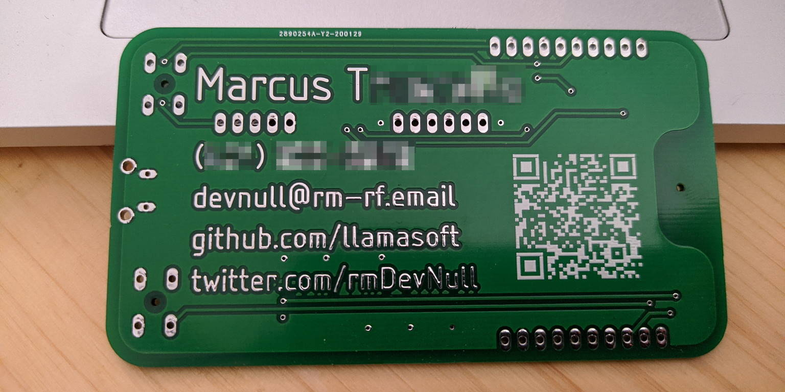
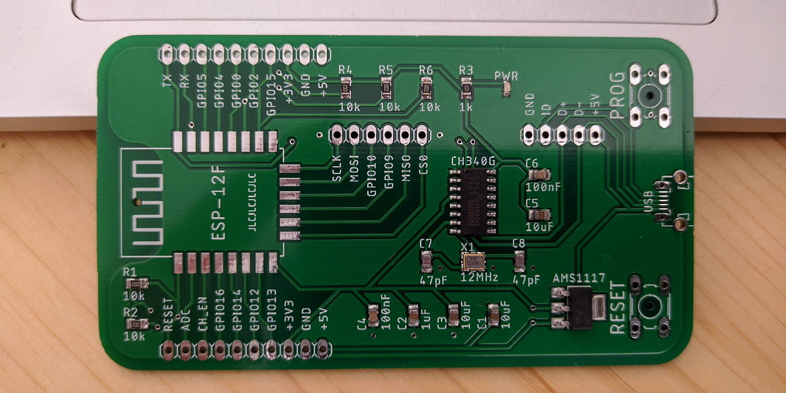

# ESP-12 PCB Business Card

This is my personal take on a PCB business card build around the ESP-12/ESP8266 WiFi SoC.  
The board was designed using [AutoDesk Eagle](https://www.autodesk.com/products/eagle/free-download) and fabricated/assembled by [JLCPCB](https://jlcpcb.com/).

## Personalizing

Load up the Eagle .brd file, then replace the dummy information with your actual information.  Export the Gerber files for your PCB manufacturer and you're good to go!

**NOTE:** The text will need to be updated on the "bottom" (layer 16) and "bStop" (layer 30) layers.  This is what allows the text's copper to be exposed.  Without modifying the "bStop" layer, your text will be hidden under the solder mask layer.  

**WARNING:** The provided `assembly.csv` file assumes that you didn't modify the location of any components.  If you did, you will need to manually recreate it.

***EXTRA WARNING:*** JLCPCB's fabrication library has the AMS1117 voltage regulator rotated differently than Eagle's libraries.  If you recreate it, you will need to manually modify the `assembly.csv` file to correct this.  Please be sure to use your manufacturer's "board preview" tools to verify the positioning of all board components.

## Assembly

All board SMD components are standard off-the-shelf parts.  Your PCB manufacturer should be able to supply most of them for you.  Larger size components have been selected to make hand-assembly easier.  All passive components use a 0805 footprint with the exception of the optional power LED (0603).

The only components you will likely need to purchase separately are the ESP-12 and micro-USB header:

- For the ESP-12, I personally recommend this [AliExpress listing](https://www.aliexpress.com/item/4000232588723.html).  At the time of writing, each chip comes out to $1.29 each, shipped.  If you have the option to get the ESP-12F over the ESP-12E as it has an optimized antenna.  
- For the micro-USB header: good luck.  They come in so many different footprints that it will be difficult to select the correct one.  For that reason, the PCB also has the USB lines broken out into standard 2.54mm headers.  This allows you to use a regular micro-USB breakout board instead, which should be much easier to acquire and solder.

## Example Images

